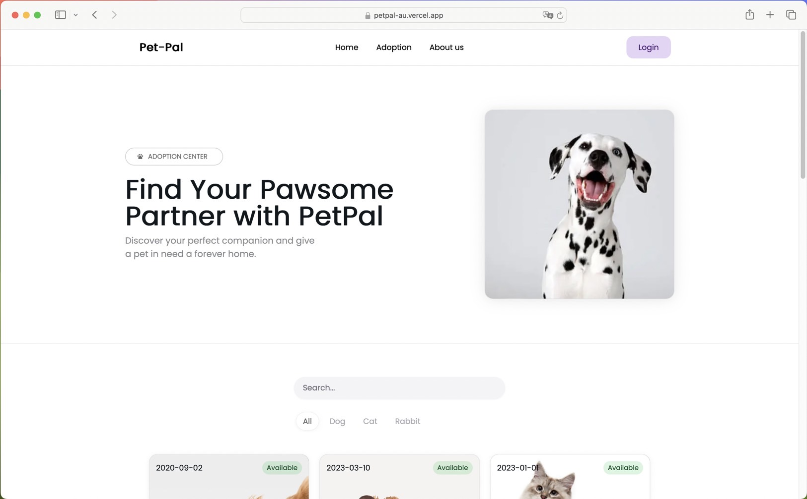
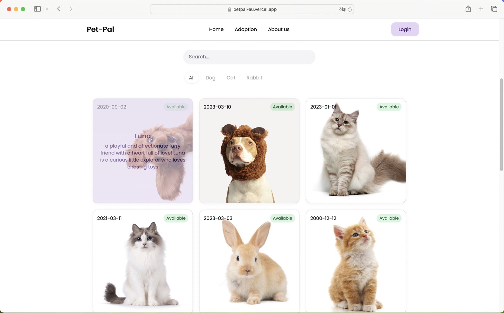
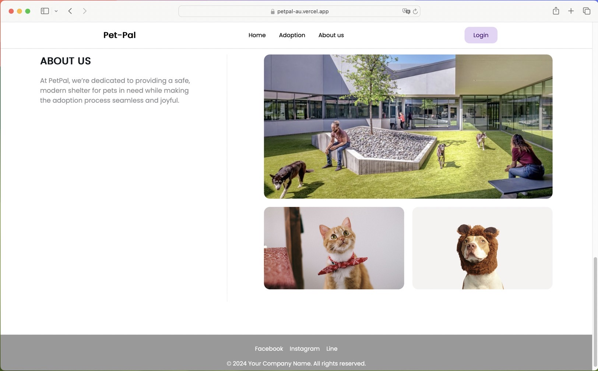
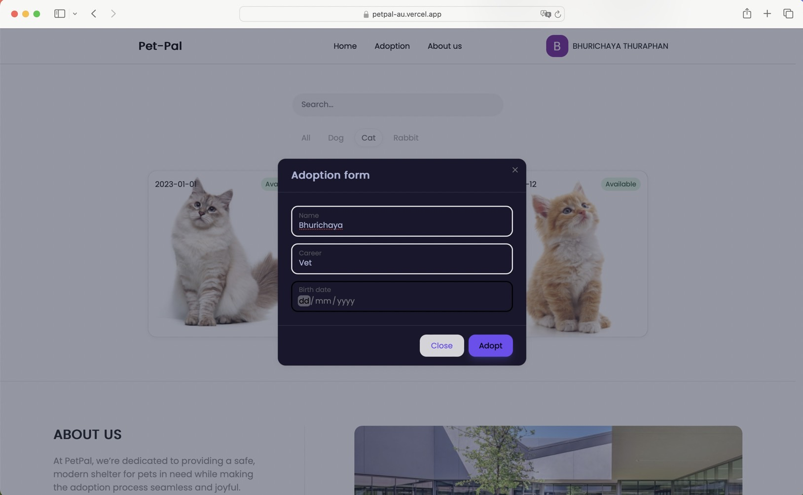
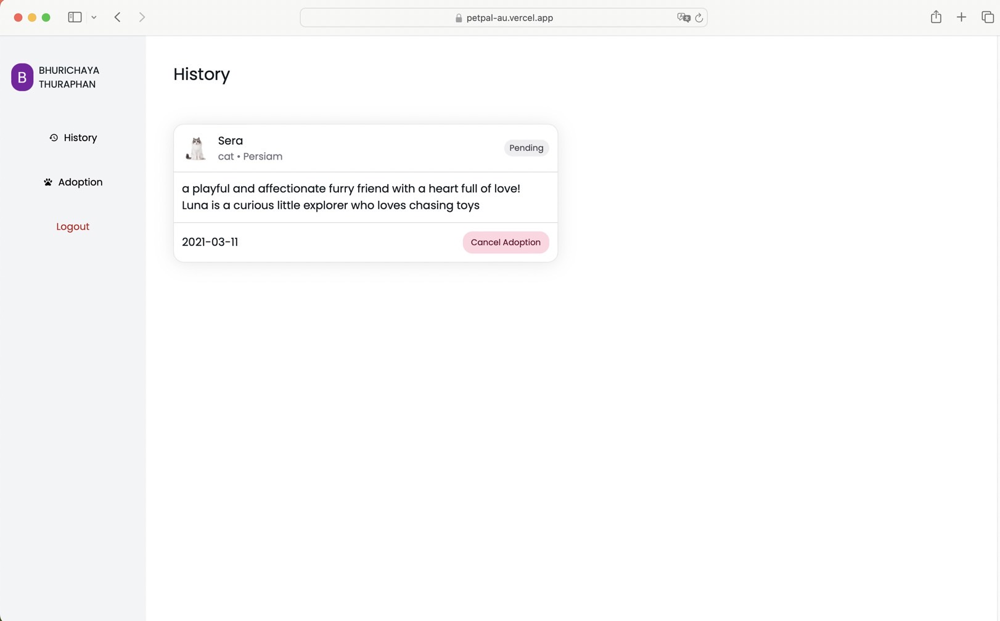
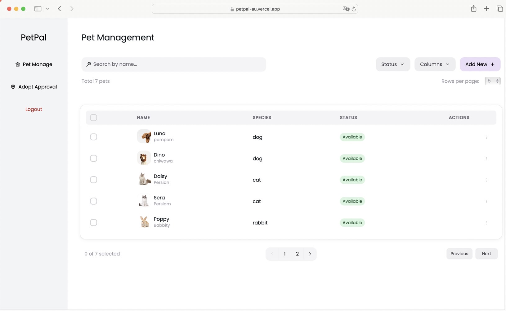
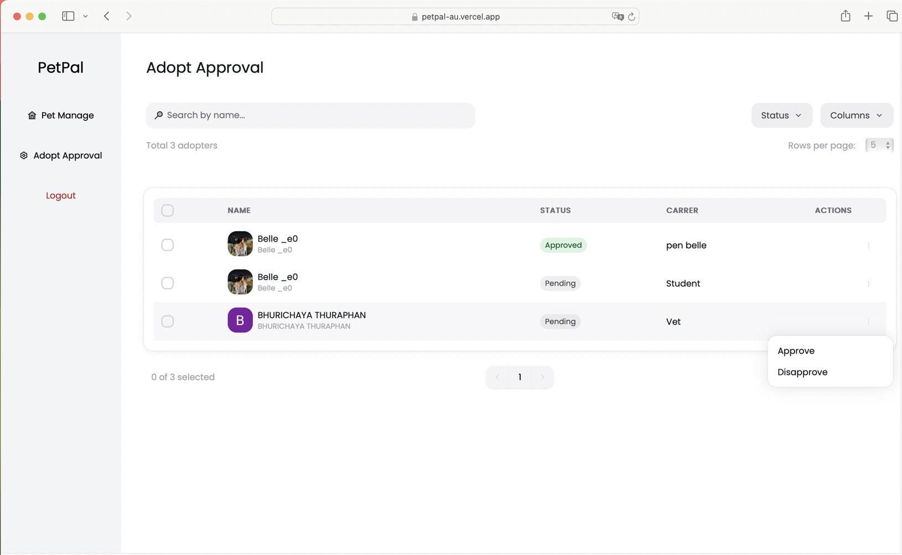

# PetPal

## Description
PetPal is an adoption platform that connects pets in shelters with potential adopters, promoting responsible pet ownership.

## Features
- Browse pets by species and name
- Adopt pet by fill in adoption request
- (Admin) Approve or reject request 
- Adoption status updates
- (User) View history adopted pets
- (User) Cancel adoption request if not yet approved
- (Admin) Add/Edit/Delete/View status pets

## Data Models
- **User**: `id`, `name`, `email`, `emailVerified`, `image`, `accounts`, `sessions`, `posts`, `AdoptionRequest`
- **Pet**: `id`, `name`, `breed`, `specie`, `birthdate`, `image`, `description`, `status`, `createedAt`, `updatedAt`, `AdoptionRequest`
- **AdoptionRequest**: `id`, `pet`, `user`, `status`, `birthdate`, `career`, `createedAt`, `updatedAt`, `petId`, `userId`

## Getting Started
1. Clone the repo:
   ```bash
   git clone https://github.com/B3113/petpal.git
2. Install dependencies:
   ```bash 
   npm install
3. Run the development server:
   ```bash
   npm run dev


## Screenshots 
### User
- Home Page


- Adopt pet


- About Us


- Adoption Form


- History


### Admin
- Pet Management


- Adopt Approval



## Members
1. Nanthanat Ounma [GitHub Profile](https://github.com/icepsn)  
2. Bhurichaya Thuraphan [GitHub Profile](https://github.com/B3113)
